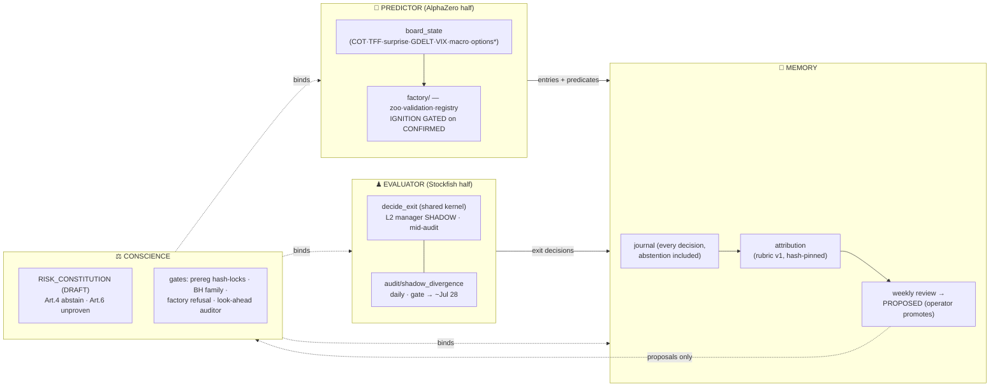

# FIRM — the four organs

One page. What the firm IS, so any session can orient in a minute. Detail lives in the
files each organ names. VISION.md is the map of intent; RISK_CONSTITUTION.md the law;
this is the anatomy.

| Organ | State (2026-07-02) | Owns | Source of truth |
|---|---|---|---|
| **Evaluator** | BUILT, mid-audit (shadow Jun 29 → ~Jul 28; L1 100%, C5=0, gate NOT-YET) | carry exits, parity live==backtest | `sovereign/forex/exit_machine.py`, `audit/divergence_spec.md` |
| **Predictor** | board BUILT (look-ahead-clean, 0 violations); factory BUILT, ignition LOCKED (0 CONFIRMED); options legs await ThetaTerminal | entries + thesis predicates (paper loop owns its own exits — specs/thesis_exit_spec.md) | `sovereign/sentiment/`, `factory/`, HYP-072…081 |
| **Conscience** | constitution DRAFT (ratification = Colin); every gate enforced in code with tests | caps, breakers, abstention right, refusal messages | `RISK_CONSTITUTION.md` + drift test, `factory/train.py` |
| **Memory** | LIVE — journal + rubric + Sunday review; first heartbeat closed 2026-07-02 | experience → attribution → proposal (never promotion) | `experience/`, `review/` |

**The multiplication:** edge = prediction-quality × execution-quality, under law, with
memory. A brilliant entry with a sloppy exit bleeds out; a perfect machine that never
metabolizes its own experience repeats itself.
