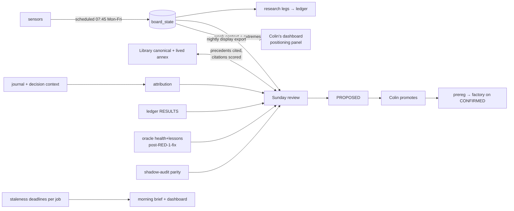

# REWIRING — the organism, as it is and as it should be

2026-07-03. Product of the seven-scout retargeting audit (`audit/retargeting/R1..R7`,
one question per organ: *what decision does it feed, and what decision could it feed*).
This is the targeting document Colin asked for. It is opinionated; the evidence lives
in the R-files.

---

## 1 · The organism as it IS

```mermaid
flowchart LR
    subgraph SENSORS["sensors (11 integrations)"]
        S1[FRED·VIX·COT·TFF·surprise·AV-news] -->|daily feeders| B
        S2[ThetaData surface+VRP] -->|weekly| B
        S3[GDELT] -.->|paced, likely fine| B
        S4[Reddit·Tiingo·Polygon·OpenWeather·Firebase] -.->|dead keys / 0 signals| X1[nothing]
    end
    B[(board_state<br/>27 cols, 0 orphans<br/>⚠ NO SCHEDULE — manual runs only)]
    B -->|read once per research run| R[positioning family runners<br/>hash-locked protocol]
    B -.->|nothing live reads it| X2[no live consumer — correct under Art.6]
    LIB[Alexandrian Library<br/>73 events + query()] -->|EVERY ICT scan<br/>threat·regime·size| ICT[ict/orchestrator]
    LIB -.->|absent from| MEM
    subgraph MEM["memory organ"]
        J[journal] --> A2[attribution<br/>7/7 AMBIGUOUS] --> W[Sunday review] --> PROP[PROPOSED → Colin]
    end
    W -.->|reads NONE of:| U[oracle reflections·ledger RESULTS·vetoes·audit reports·fills]
    ORC[Oracle reflect cycle] -->|RED-1: reads CONTAMINATED<br/>backfilled summaries| ORC
    DASH[Colin's dashboards] <-->|separate producer set| X3[board never shown]
    HW[health.responder watchdog] -.->|dead 19 days| X4[nobody watches the watchdogs]
```

Honest summary: **the sensors are good and the board is clean, but the board is a
manually-cranked organ feeding exactly one consumer (research runs), the Library
fights in only one theater (ICT), the review is blind to five adjacent truth sources,
the Oracle is quarantined by its own intake, and the health layer is dead.** The
pieces are extraordinarily well built. They are not aimed.

## 2 · The organism as it SHOULD BE



One sentence: **everything the machine senses reaches the weekly decision loop and
Colin's eyes; everything the loop serves is cited and later scored; nothing runs
unwatched.**

## 3 · Ranked rewirings (decision-improvement per unit effort)

| # | Rewiring | Evidence | Effort | Class |
|---|----------|----------|--------|-------|
| 1 | **Schedule the sensory organ** — the existing `com.alta.sentiment_update` plist (07:45 Mon–Fri) is verified correct but was never installed; the board is 3 days stale and every future consumer inherits staleness. Loading a launchd job is a live-organ-surface change → **Colin executes** (session permission layer refused it to the machine, correctly): `cp scripts/com.alta.sentiment_update.plist ~/Library/LaunchAgents/ && launchctl load ~/Library/LaunchAgents/com.alta.sentiment_update.plist`, then `python3 scripts/plist_watchdog.py --rebaseline "loaded sentiment_update"`. | R1 | one command | READY — Colin's hand (TICK-013) |
| 2 | **Library ascension** — TICK-005: lived-experience annex + review-time precedents + scored citations (design verified; canonical json stays untouched — it is LIVE-read *and* live-written by `learn()`). | R2/R3 + plan | 1 builder session | SAFE-NOW (built today) |
| 3 | **Review forensics feeds** — the Sunday review reads: oracle `system_health_note`, the week's ledger RESULTS (status Counter — the loop currently proposes but never hears verdicts), acted:abstained:vetoed ratio, shadow-audit parity line. Four small guarded reads. | R3 | ~1h | SAFE-NOW (TICK-006) |
| 4 | **Suite must not trade** — `test_oanda_set_stop.py` placed a real practice order on every plain `pytest tests/` run (the "unidentified OANDA writer" = ourselves). Env-gated opt-in. | R7 | done | SAFE-NOW (done today) |
| 5 | **Dashboard parity, board→Colin direction** — nightly board-row export + a Positioning panel (COT%, TFF, VRP, rr25/bf25, surprise_z reach no panel today). Display-only. | R6 | export ~30min; panel = master-branch deploy session | SAFE-NOW (TICK-007) |
| 6 | **Health resurrection** — watchdog trifecta dead 18+ days (`health.responder` itself stalest); 3 jobs log to /tmp. One design: per-job staleness deadlines surfaced in the morning brief + dashboard; plist log-redirect batch. Needs diagnosis first, and plist edits are live-organ changes → Colin-reviewed batch. | R7 | 1 session | SAFE-NOW ticket, build next (TICK-008) |
| 7 | **Numba re-enable** — the 1.26M bars/s engine runs at 123k (py3.14 × numba incompat). One env fix recovers ~10×. Not during a live race day. | R4 | env session | SAFE-NOW ticket (TICK-009) |
| 8 | **Journal context preservation** — journal_sync keeps 3 of ~60 decision-logger fields; the machine's own memory discards its reasoning. Additive field pass-through. Sequenced AFTER Sunday's first organic beat (don't touch the memory organ's writer before its unattended-fire verification). | R3/R6 | ~1h | SAFE-NOW ticket, post-Jul-6 (TICK-010) |
| 9 | **Oracle un-quarantine** — RED-1 BLUE fix (source-exclusion in `reflect_cycle`). Pre-registered by the 07-03 audit; **awaiting Colin's review** — nothing built until then; porting oracle outputs anywhere is blocked behind it. | R5 | small, gated | blocked_until: colin_review (TICK-011) |
| 10 | **Fast engine = the NEXT research harness** — hypothesis testing replays static trades while a 6-figure-bars/s simulator idles. This retarget applies to the *successor* families and the discovery bench — **not** to HYP-072..081, whose hash-locked protocol is event-study by design; swapping engines mid-family would be a prereg violation dressed as an optimization. | R4 | design session | blocked_until: family_adjudicated (TICK-012) |
| 11 | GDELT resume-cursor; vault-graph post-learn regen hook; .smart-env consumer spec | R1/R2 | small | backlog, unranked |

**Both family outcomes are wired for:**
- *All-null (the prior):* the VISION kill-criterion fires — the crowd-prediction thesis
  is falsified **at current data resolution**. The board does NOT die: it retargets
  from hypothesis-substrate to (a) review/memory context (#2, #3), (b) display (#5),
  (c) defensive overlays IF HYP-077-class gates ever earn evidence. The AlphaZero
  half's next attempt needs *new resolution* (intraday/order-flow data) — a data
  acquisition question, not an eleventh hypothesis on the same board.
- *A CONFIRMED:* Article-6 ignition ceremony (Colin witnesses, live), model registered,
  paper adapter under ratified caps — the factory's train/validation path already
  exists and deliberately awaits exactly this label definition (R4 confirmed the
  "missing" stage is Article 6 working as intended).

## 4 · LEFT ALONE, deliberately

- **The exit engine + shadow audit** — frozen, mid-proof, gate ~Jul 28. Not touched, not discussed.
- **factory/train label deferral + research_factory dry-run** — the conscience layer working as designed; "finishing" them today would be the violation.
- **The v1 family runner** — a sealed instrument; its seals must stay reproducible. The successor harness is a new build (#10), not an edit.
- **Board schema** — zero orphan columns; every column maps to a prereg or the regime backbone. It does not need more sensors; it needs consumers (see #1/#3/#5).
- **ict/library_bridge** — the lazy sovereign→ICT import is the sanctioned bridge; the NN#1 wording cleanup is already on Colin's §S2 list.
- **Big Move, killzone telemetry, futures bias** — wrong market or unvalidated; porting them into the forex loop would be reuse-for-its-own-sake. (Portable exceptions, both tiny: lesson-velocity line + the briefing's FRED macro block → fold into TICK-006.)
- **00-BRAIN** — the human memory organ is current and correct; automation would degrade it.

## 5 · Attic-candidates — Colin's ruling list (nothing moved today)

1. `com.alta.cache.refresh` Reddit path — hourly job, HTTP 403, 0 signals, no board join (job keep/kill is yours; existing §S2 protocol).
2. Dead .env credentials: TIINGO, OPENWEATHER, FIREBASE_*, AV-technical; POLYGON belongs to the equity-engine batch ruling.
3. `sovereign/intelligence/cross_system_bridge.py` — library consumer with no live caller (batches with the §S2 equity-engine/ict-engine ruling).
4. `.smart-env` embeddings (~671 files) — orphaned index, no consumer; keep only if a semantic-search consumer gets specced.
5. Bench telemetry (`com.alta.bench` + 3 output files) — nothing reads it; either the 5-line regression alert gets wired (TICK-008 scope) or it goes to the attic list.
6. `stray_tripwire` WatchPaths mode — the watch trigger has been inert since Jun 7 (manual invocation works); re-arm or retire the watch mode in the TICK-008 health batch.

## 6 · Temptations refused (they looked like rewirings)

- Wiring board signals into live readiness gates (`decision_chain` Q2/Q3, regime-confidence stubs): **live capital on unproven edges** — Article 6. Display parity yes; gate wiring only behind a CONFIRMED verdict and a logged param change.
- Swapping the fast backtester into the locked family mid-run (see #10).
- Inferring `exit_reason` from close timing to un-AMBIGUOUS the attribution rows: Day-1's refusal stands — that inference is exactly what `PROP-2026-W27-exit-reason-capture` exists to solve properly at the write path (Colin promotes or declines).
- "Fixing" the 40 known test failures, resolving §S2 items, or committing the RED-1 BLUE fix without review.
