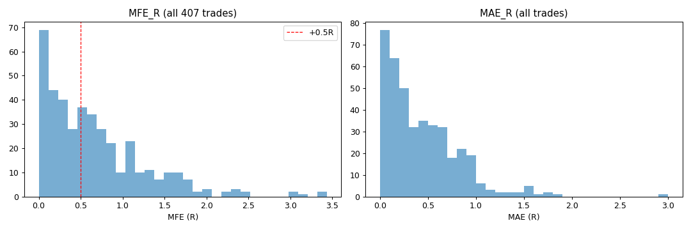
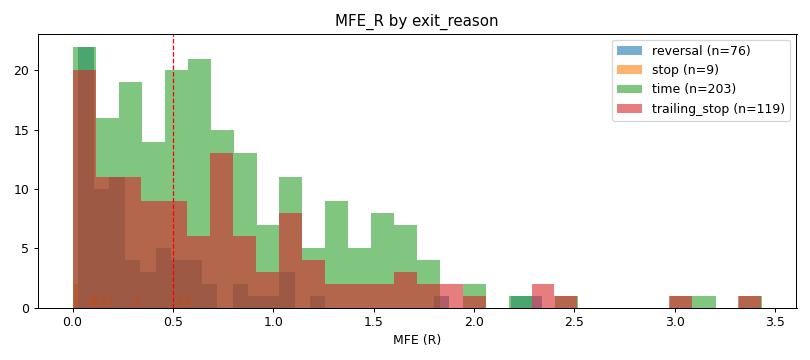
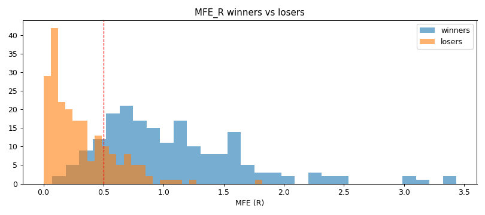
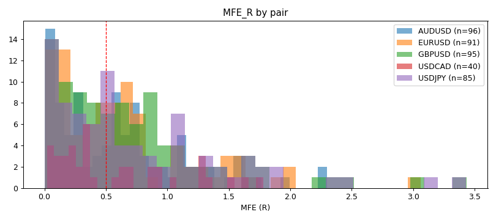
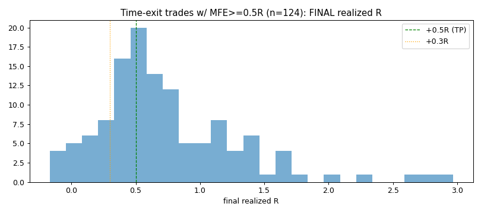

# Excursion Analysis — HYP-064 carry trades (L2 partial-exit thesis test)

> READ-ONLY measurement. Price paths re-read from the same yfinance OHLC HYP-064 used; nothing written to production. R = excursion / (2.0 × ATR%@entry). MFE is intrabar (high/low) — what a take-profit order would actually catch.

**Trades:** 407 (unmatched dropped: 1)  ·  MFE_R median **0.533** / mean 0.668  ·  MAE_R median 0.341

## Which world are we in?

**THESIS REJECTED — partial-exit-at-0.5R HURTS, don't build it.** Trades that reach +0.5R mostly KEEP RUNNING, they don't fade: the time-exit trades that touched +0.5R close at mean **0.745R** (only 17.7% fade below +0.3R). Taking half off at +0.5R caps those winners → counterfactual uplift **-0.0006R/trade** (negative). The edge is carry's winners RUNNING; partial exit kills the asymmetry. **L2's lever is NOT exit-banking — it's the LOSS side** (53% of trades lose; the MAE table shows how much heat they take). New hypothesis to measure next: cut losers faster (tighter/structural stop) without clipping the runners.

## % of trades reaching each MFE / MAE threshold (R)

| threshold | % reaching MFE | % reaching MAE |
|---|---|---|
| 0.3R | 66.6% | 53.1% |
| 0.5R | 52.1% | 36.6% |
| 0.8R | 31.2% | 16.2% |
| 1.0R | 23.6% | 6.1% |
| 1.5R | 10.1% | 2.5% |
| 2.0R | 3.2% | 0.2% |

## Load-bearing: the 203 time-exit trades

- reached MFE ≥ 0.5R during their life: **61.1%** (124 of 203)
- that subset's FINAL realized R: mean **0.745**, median 0.598
- of that subset, **17.7% closed below +0.3R** (i.e. touched +0.5R then faded — money a partial close would have banked)

## First-order counterfactual (close half at +0.5R when MFE≥0.5R, hold the rest)

> First-order only — the remaining half's path is held fixed. The true test is L2 re-running the exit machine with partials; this just sizes the prize.

- ALL trades: actual mean 0.1182R → partial 0.1177R (**uplift -0.0006R/trade**)
- time-exit subset: actual 0.3758R → partial 0.301R (**uplift -0.0748R/trade**)

## Figures

- 
- 
- 
- 
- 

