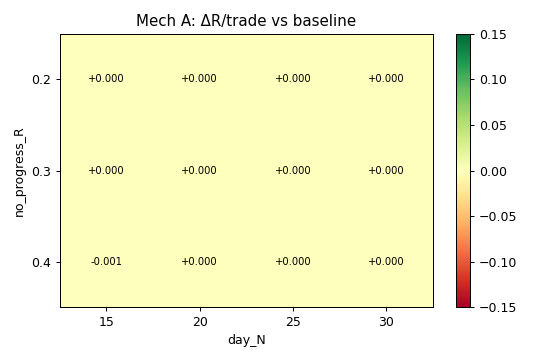
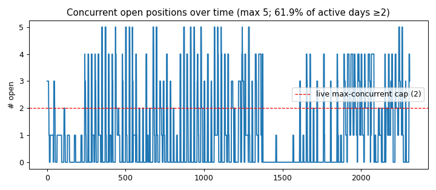

# Loss-side exit measurement — HYP-064 carry trades

> EXPLORATORY / in-sample (params excursion-informed). Candidates need separate OOS validation.  READ-ONLY; holdout untouched. R = pnl_pct / (2·ATR%@entry).

**Trades:** 407 (unmatched 1)  ·  **baseline mean R 0.1182** / win 0.474

**Slot contention:** max concurrent 5; 61.9% of active days had ≥2 open, 43.0% ≥3 (how often the live 2-position cap would bind → whether freeing a slot has value).

## Decision matrix (Δ vs baseline; cut-winner-R>0 means we're cutting winners — bad)

| mechanism | ΔR/trade | mean R | win rate | % cut | cut-trades mean orig-R | slot-days freed |
|---|---|---|---|---|---|---|
| A X0.2_d15 | +0.0 | 0.1182 | 0.474 | 0.0% | None | 0 |
| A X0.2_d20 | +0.0 | 0.1182 | 0.474 | 0.0% | None | 0 |
| A X0.2_d25 | +0.0 | 0.1182 | 0.474 | 0.0% | None | 0 |
| A X0.2_d30 | +0.0 | 0.1182 | 0.474 | 0.0% | None | 0 |
| A X0.3_d15 | +0.0 | 0.1182 | 0.474 | 0.0% | None | 0 |
| A X0.3_d20 | +0.0 | 0.1182 | 0.474 | 0.0% | None | 0 |
| A X0.3_d25 | +0.0 | 0.1182 | 0.474 | 0.0% | None | 0 |
| A X0.3_d30 | +0.0 | 0.1182 | 0.474 | 0.0% | None | 0 |
| A X0.4_d15 | -0.0007 | 0.1175 | 0.474 | 0.2% | 0.393 | 4 |
| A X0.4_d20 | +0.0 | 0.1182 | 0.474 | 0.0% | None | 0 |
| A X0.4_d25 | +0.0 | 0.1182 | 0.474 | 0.0% | None | 0 |
| A X0.4_d30 | +0.0 | 0.1182 | 0.474 | 0.0% | None | 0 |
| B thr0.15 | -0.0049 | 0.1134 | 0.472 | 13.8% | 0.137 | 262 |
| B thr0.25 | -0.0022 | 0.116 | 0.472 | 11.1% | 0.074 | 177 |
| B thr0.35 | +0.0034 | 0.1217 | 0.472 | 7.6% | -0.074 | 110 |
| C atr1.0 | -0.0491 | 0.0691 | 0.418 | 28.3% | -0.326 | 434 |
| C atr1.25 | -0.0256 | 0.0927 | 0.459 | 18.7% | -0.488 | 212 |
| C atr1.5 | -0.0174 | 0.1008 | 0.464 | 9.8% | -0.573 | 112 |

## Best per mechanism

- **A (time-velocity):** X0.2_d15 → ΔR +0.0/trade, cut 0.0%, cut-trades orig-R mean None
- **B (adverse-velocity):** thr0.35 → ΔR +0.0034/trade, cut 7.6%, cut-trades orig-R mean -0.074
- **C (tighter ATR stop, control):** atr1.5 → ΔR -0.0174/trade (expected ~0 per the MAE table)

## Candidates for OOS validation (ΔR ≥ +0.10, IN-SAMPLE — not validated edge)

- **NONE.** No mechanism clears +0.10R/trade in-sample. The loss-side lever, as formulated, does not show meaningful uplift on this dataset — like partial-exit, the intuition does not survive measurement. Re-think the mechanism or accept the edge as-is.

## Figures

- 
- 

